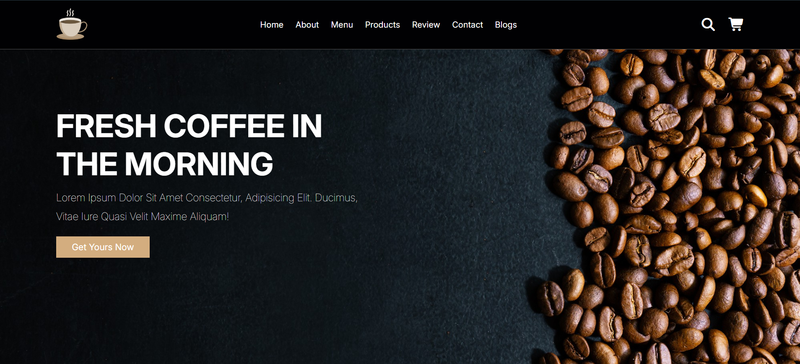

# ☕ Coffee Shop Website
A **responsive coffee shop website** built with **HTML, CSS, and JavaScript**. It features a modern UI, interactive navigation menu, product showcases, and mobile-friendly design.

## 🚀 Features
- **Fully Responsive** — adapts to all screen sizes.  
- **Interactive Navbar** — toggle menu, search, and cart items with smooth animations.  
- **Product Showcase** — display coffee menu, products, and prices.  
- **Customer Reviews** — styled testimonials section.  
- **Contact Form** — integrated Google Maps and user-friendly input fields.  
- **Blog Section** — share coffee-related posts.  
- **Modern UI** — clean typography and animations.  

## 🛠️ Tech Stack
- **HTML5** — semantic markup for structure.  
- **CSS3** — modern styling with flexbox & grid.  
- **JavaScript (Vanilla)** — interactivity & DOM manipulation.  
- **Font Awesome & Ionicons** — icon sets for UI elements.  
- **Google Fonts (Inter)** — typography styling.  

## 📂 Project Structure
```
.
├── index.html      # Main HTML file
├── style.css       # Stylesheet
├── script.js       # JavaScript functionality
├── images/         # Logo, product images, and section images
└── README.md       # Project documentation
```

## 📸 Preview
    

## 📦 How to Use
1. **Clone the repository**  
   ```bash
   git clone https://github.com/your-cyriljaiswal/coffee-shop.git
   ```
2. **Navigate to the project folder**  
   ```bash
   cd coffee-shop
   ```
3. **Open `index.html` in your browser**  
   - You can double-click the file or run a live server in VS Code.  

## 📱 Responsive Design
- The site is optimized for desktop, tablet, and mobile screens.  
- Uses media queries for layout adjustments.  

## 🤝 Contributing
Feel free to fork this repo, make improvements, and create a pull request. Suggestions and bug reports are welcome!  

## 📜 License
This project is open-source and available under the [MIT License](LICENSE).  

**Created by** Cyril Jaiswal ✨  
